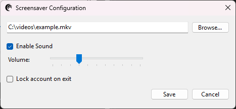

# AbstractScreenSaver
Have you ever wanted to embed custom video as a screensaver, but it turned out to be more complicated than it needed?  
Worry no more! :) 

## Features
Play your video across all of your screens (even supports playing audio and lock on exit)! 
 
[Available on YouTube](https://www.youtube.com/watch?v=lH6qlF_iegU) (by Relaxation Time - 4K Amazing Relaxing Screensavers)

Customize based on your needs! 

This app supports all of the mainstream video formats: 
- MP4, MKV, AVI, MOV, FLV, WMV, WebM, TS, OGV
- M4V, 3GP, F4V, VOB, MPEG/MPG

## Instalation
- Install latest [.NET 8 Desktop Runtime](https://dotnet.microsoft.com/en-us/download/dotnet/8.0)
- Extract latest release into your desired folder (e.g. create "screensavers" folder in Videos and extract the app there)
- Right click .scr file and click install
- In "Screen Saver Settings" window click on "Settings..." button and select your video (enable sound, set volume)
- Enjoy your custom screensaver :D
